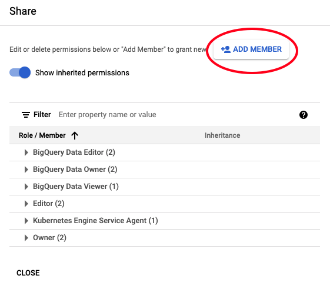
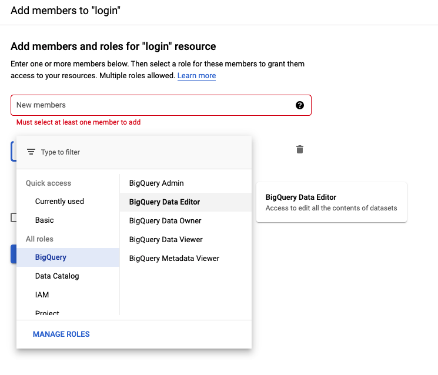

# Analytics
Analytics is a Napptive library to monitoring operational data

This lib allows you to send data to a provider for monitoring tasks

For now, only BigQuery provider is implemented, but it is too easy to add providers. Just implementing the interface:

```
// Provider with an interface that defines the monitoring provider methods
type Provider interface {
	// Send inserts the data in the database
	Send(data entities.Operation) error
}
```

## BigQuery provider

1.Create a client
```
func NewBigQueryProvidercfg config.BigQueryConfig) (Provider, error) {
```
where 
```
// BigQueryConfig with the bigQuery provider configuration
type BigQueryConfig struct {
	// ProjectID with the GKE project identifier
	ProjectID string
	// Schema with the BigQuery Schema
	Schema string
	// Table with the BigQuery table name
	Table string
	// CredentialsPath with the Service Account credentials file
	CredentialsPath string
	// SendingTime is the time between database inserts
	SendingTime time.Duration
}
```
- `SendingTime` is the waiting time to make inserts in the database. 
  The data is stored in a cache and sent every so often

---

## Getting credentials
Read [google documentation](https://cloud.google.com/docs/authentication/production#cloud-console) to create the *ServiceAccount* and, a *key*
Once you have created them, you can share the tables with the service account:

1. Go to table schema, and click on `SHARE` option
   
2. Add a member
   
3. Fill the member with the Service Account created and BigQuery>BigQuert Data Editor Role
   
   
## License

 Copyright 2020 Napptive

 Licensed under the Apache License, Version 2.0 (the "License");
 you may not use this file except in compliance with the License.
 You may obtain a copy of the License at

      https://www.apache.org/licenses/LICENSE-2.0

 Unless required by applicable law or agreed to in writing, software
 distributed under the License is distributed on an "AS IS" BASIS,
 WITHOUT WARRANTIES OR CONDITIONS OF ANY KIND, either express or implied.
 See the License for the specific language governing permissions and
 limitations under the License.
